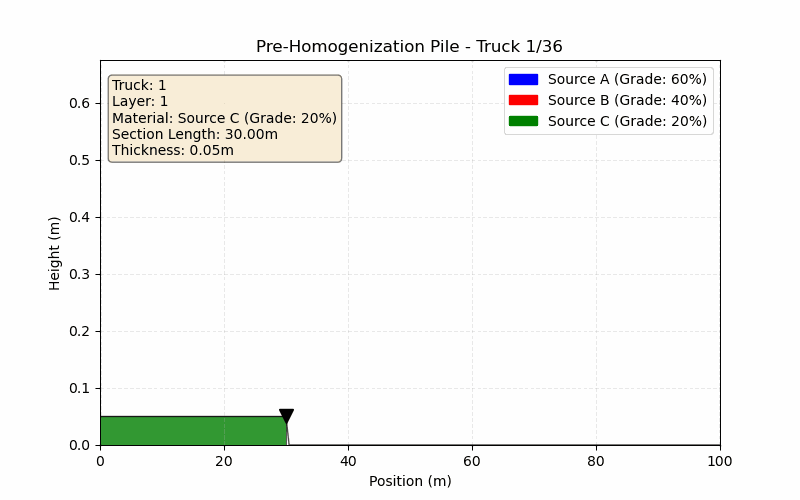

# ⛏️ Pre-Homogenization Pile Simulator — Chevron Stacking Edition

A lightweight and interactive **Streamlit** web application that simulates the formation of a **pre-homogenization ore pile using the Chevron stacking method**. This tool is ideal for mining professionals, students, and researchers working with **grade blending**, **ore distribution**, and **production modeling**.



---

## 🚀 Features

- 📈 **Dynamic Longitudinal Section** — Visualize how material layers build up during Chevron stacking.
- 🧪 **Grade Distribution Metrics** — Get real-time calculations for **mean** and **standard deviation** of ore grades.
- ⚙️ **Customizable Inputs** — Control blending ratios, truck payload, number of operational areas (benches), and stacker behavior via the sidebar.
- 🖼️ **Export-Ready Visuals** — Save simulation outputs and figures for reporting or analysis.

---

## 📦 Installation & Running the App

```bash
# Clone the repository
git clone https://github.com/RRN-Code/pile-simulation.git
cd pile-simulation

# Run the app
streamlit run app.py
